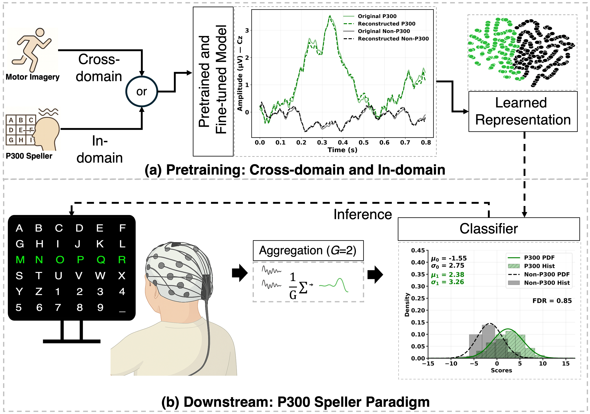
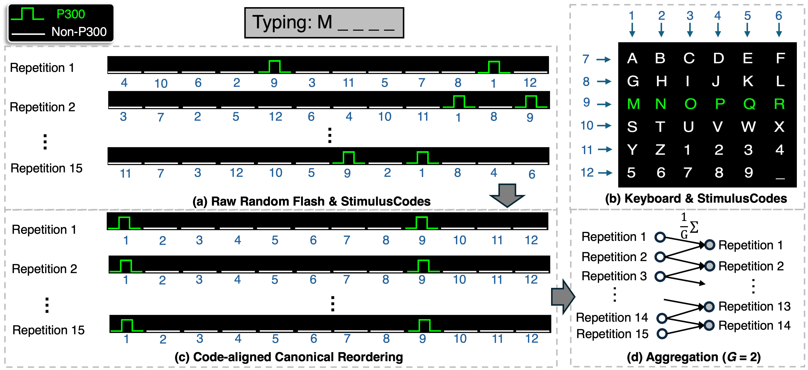
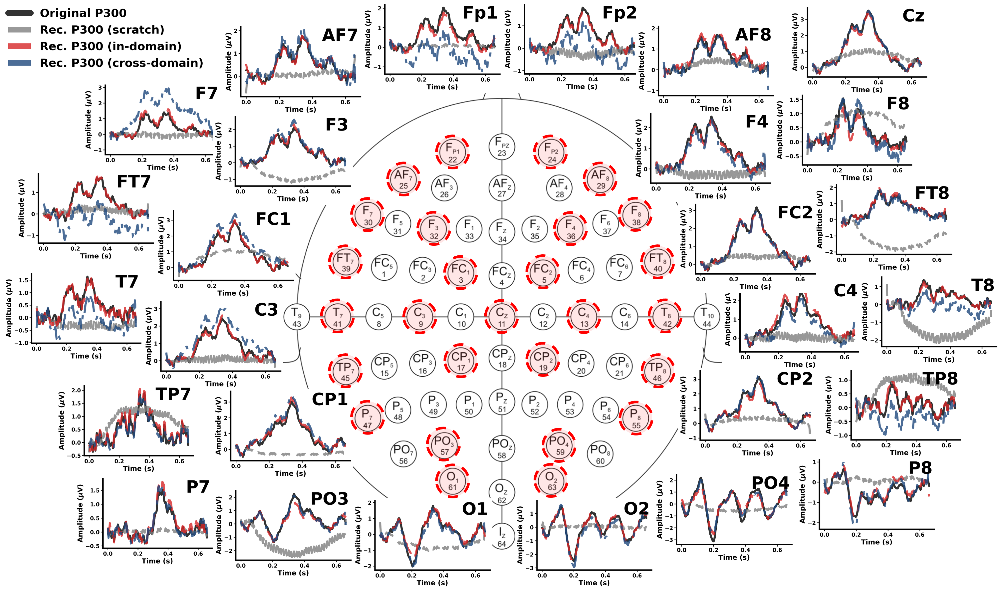

# SpellerSSL
Self-Supervised Learning with P300 Aggregation for Speller BCIs.  
This repository provides the P300 aggregation algorithm, pretraining, fine-tuning, and evaluation on public datasets, with figures and checkpoints.

# Update
2025-09-22: Paper accepted at the [Brain & Mind @ NeurIPS 2025](https://data-brain-mind.github.io/).  
The paper is in the proceedings. Preprint available on arXiv.

## Overview
<p align="center">
  
</p>

## Summary
- Goal: improve P300 speller accuracy, speed, calibration efficiency  
- Method: reconstruction-based pretraining with a 1D U-Net encoder and a light ERP head  
- P300 aggregation: code-aligned grouping of repetitions to enhance SNR  
- Results: high character recognition rate, high information transfer rate, reduced calibration

## Results
- In-domain SSL with aggregation reaches **94% Character Recognition Rate** at 7 repetitions  
- Achieves peak **ITR of 21.86 bits/min**, higher than prior state-of-the-art  
- Reduces calibration size by **60%** while maintaining comparable accuracy  
- Cross-domain SSL shows strong transferability from motor imagery to P300  

### Comparison of ITR (bits/min)

| Model            | Peak ITR | Avg. ITR |
|------------------|----------|----------|
| CNN-1 [1] | 15.47    | 11.80    |
| MCNN-1 [1] | 16.74    | 12.29    |
| ERP-CapsNet [2] | 19.23    | 13.20    |
| ST-CapsNet [3] | 19.74    | 13.53    |
| SWFP [4]   | 19.23    | 12.78    |
| S-LDA [5] | 16.25    | 12.14    |
| P3T [6]      | 20.52    | 13.42    |
| **SpellerSSL (Cross-domain)** | **21.86** | **14.05** |
| **SpellerSSL (In-domain)**    | **21.86** | **14.04** |
| **SpellerSSL (In-domain, 60\%)**    | **19.62** | **13.52** |


## P300 Aggregation

<p align="center">
  
</p>

## Reconstruction Result

<p align="center">
  
</p>


## Project Layout
```bash
DBM-Github/
├─ Checkpoint/
│  ├─ Downstream/
│  └─ Pretraining/
├─ dataset/
├─ Figures/
│  ├─ Aggregation.png
│  ├─ Overview.png
│  └─ Recon.png
├─ models/
├─ utility/
├─ Fine.py
├─ Aggregation.py
└─ SSL.py
```

## Quick start

1. Save or link datasets under `dataset/`  
2. Run self supervised pretraining:

```bash
python SSL.py \
  --data_file <path_to_npz_or_npy> \
  --orig_fs 240 --target_fs 240 --dur_ms 667 --align start \
  --model_name UNet1D --loss L1WithSpectralLoss --epochs 200 --batch_size 64
```

3.	Run fine tuning:
```bash
python Fine.py --data_dir <path_to_aggregation_npz_dir>
```


## Reference

[1] Hubert Cecotti and Axel Graser. Convolutional neural networks for P300 detection with application to brain–239
computer interfaces. IEEE Transactions on Pattern Analysis and Machine Intelligence, 33(3):433–445,240
2010.

[2] Ronghua Ma, Tianyou Yu, Xiaoli Zhong, Zhu Liang Yu, Yuanqing Li, and Zhenghui Gu. Capsule network
for ERP detection in brain–computer interface. IEEE Transactions on Neural Systems and Rehabilitation
Engineering, 29:718–730, 2021.244

[3] Zehui Wang, Chuangquan Chen, Junhua Li, Feng Wan, Yu Sun, and Hongtao Wang. ST-CapsNet: Linking
spatial and temporal attention with capsule network for P300 detection improvement. IEEE Transactions
on Neural Systems and Rehabilitation Engineering, 31:991–1000, 2023.232

[4] Benjamin Blankertz, Steven Lemm, Matthias Treder, Stefan Haufe, and Klaus-Robert Müller. Single-trial266
analysis and classification of erp components—a tutorial. NeuroImage, 56(2):814–825, 2011.

[5] Adam D Gerson, Lucas C Parra, and Paul Sajda. Cortically coupled computer vision for rapid image
search. IEEE Transactions on neural systems and rehabilitation engineering, 14(2):174–179, 2006.

[6] Jiazhen Hong and Laleh Najafizadeh. P3t: A transformer model for enhancing character recognition rates
in p300 speller systems. In 2024 58th Asilomar Conference on Signals, Systems, and Computers, pages
514–518, 2024.
